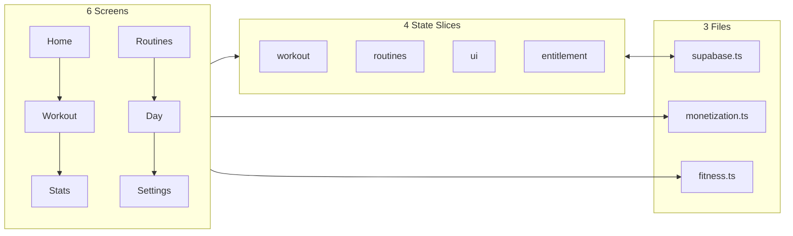
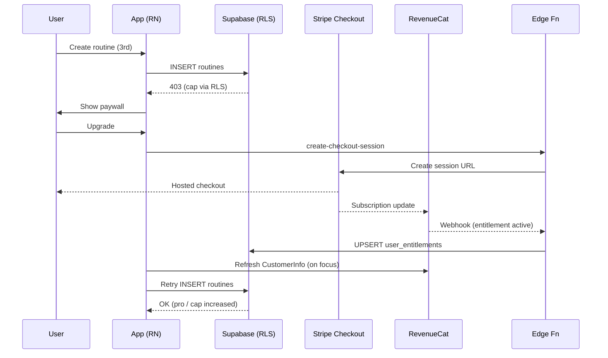

# Low Level Design (Sketch, Lean)

## App Structure (RN + Expo)
- Navigation (Bottom Tabs): `Home`, `Workouts`, `Statistics`, `Settings`
- Screens (examples):
  - HomeScreen: calendar grid, streak counters, session quick-links
  - RoutinesScreen: list + create/edit routine; day cards (Mon–Sun)
  - DayDetailScreen: tags selector, exercise list (manual + suggest)
  - WorkoutScreen: active session (timer, current exercise, set logger)
  - StatsScreen: aggregates + strength score chart
  - SettingsScreen: units/equipment, account deletion, upgrade/paywall

### Diagram — Lean Module Structure

## State (Zustand/Redux slices)
- workout: { activeSession: { id, startedAt, currentExerciseId } }
- routines: normalized cache (routines, days, exercises) — fetched on tab open
- ui: { toasts, modals, paywallVisible }
- entitlement: { pro, maxRoutines, fetchedAt } — from RevenueCat CustomerInfo

## Services / Modules (Lean: 3 files)
- **services/supabase.ts** — client init, auth storage, all DB queries (routines, sessions, sets, stats)
- **services/monetization.ts** — RevenueCat init/CustomerInfo + Stripe checkout (Edge Function call + browser open)
- **utils/fitness.ts** — on-device logic: exercise suggestions (scorer), streaks, strength score (Option A)

## Key Flows (Sequence Sketches)
- Create Routine (free)
  1) User taps "Create"
  2) Insert `routines` → RLS check (≤2 ok) → success
  3) Navigate to routine days
- Create Routine (paywalled)
  1) `supabase.insertRoutine()` → RLS rejects (≥cap) → show paywall
  2) User taps Upgrade → `monetization.startCheckout(plan)` opens Stripe
  3) Stripe success → RevenueCat webhook → `user_entitlements` updated
  4) App regains focus → `monetization.refreshCustomerInfo()` → retry insert (allowed)
- Start Workout
  1) `supabase.startSession()` → write `started_at`; activate keep-awake
  2) Timer renders `now() - startedAt` on tick/resume; no setInterval drift
  3) Set logging: `supabase.logSet()` writes to `workout_sets`; auto-advance UI
  4) End → `supabase.endSession()` sets `ended_at`; compute duration client-side

### Sequence — Paywalled Routine Creation

## Error Handling (Minimal)
- Inline errors for failed writes; retry with backoff
- Checkout errors: toast and retry; no partial writes
- Webhook delays: UI trusts RevenueCat; pull-to-refresh entitlements

## Configuration
- Env vars: SUPABASE_URL, SUPABASE_ANON_KEY, STRIPE_PRICE_MONTHLY, STRIPE_PRICE_ANNUAL, CHECKOUT_SUCCESS_URL, CHECKOUT_CANCEL_URL, RC_API_KEY_IOS, RC_API_KEY_ANDROID
- Exercise templates: `src/data/exerciseTemplates.json` (static)

## Build/Dist
- EAS builds; TestFlight; Sign in with Apple; privacy text

